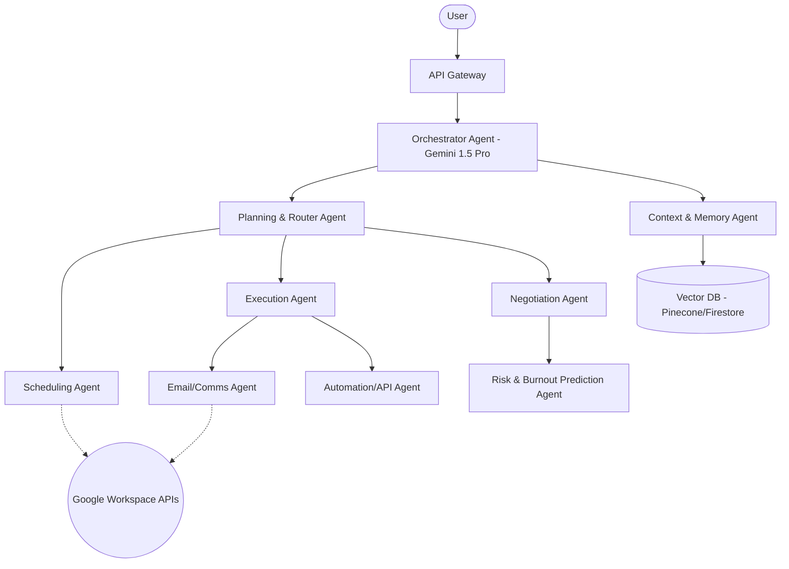

# 🏆 VibeCode 2.0 Master Blueprint: SYNTROPY

> [!IMPORTANT]
> **To the Engineering & Product Team:** This blueprint is designed to win VibeCode 2.0. We are completely abandoning the concept of a "productivity app." Productivity apps remind users of their failures. We are building an **Autonomous Execution Partner**.

---

## PART 1 — Startup Foundation

**Product Name Options:**
1. Syntropy  2. Preempt  3. Kairos  4. Executary  5. Momentum  6. Catalyst  7. Zenith  8. FlowState  9. Proacta  10. OmniSync  11. Aegis  12. Cognex  13. Velocity  14. Frontline  15. Automa  16. Apex  17. Cortex  18. Anticipate  19. Vanguard  20. Epiphany

**Final Selected Name:** **Syntropy** (Definition: The opposite of entropy; the tendency towards order, organization, and predictable execution.)

**Tagline:** "Don't manage time. Execute it."

**Vision:** A world where human potential is never bottlenecked by administrative friction, decision fatigue, or cognitive overload.

**Mission:** To eliminate the cold start problem for every commitment by autonomously preparing, negotiating, and executing the pre-work before you even realize you need it.

**Elevator Pitch:** Productivity tools are broken because they assume humans operate like machines. They give you a notification and expect you to work. Syntropy is an AI execution partner that predicts when you will fail, negotiates time on your behalf, and autonomously completes the first 20% of your tasks—drafting the email, pulling the research, summarizing the context—so when you sit down, you aren't starting; you're just finishing.

**One-line Pitch:** Syntropy doesn't remind you to do your work; it starts your work for you.

**Product Story / Origin:** The team realized during finals week and startup crunch times that missed deadlines weren't due to forgetting; they were due to "activation energy." The sheer dread of starting a blank document or figuring out *how* to start a complex task caused procrastination. We built Syntropy to bridge the gap between "knowing what to do" and "doing it."

---

## PART 2 — Deep Problem Research

**Why People Actually Miss Deadlines:**
- **Executive Dysfunction & Activation Energy:** The brain requires immense cognitive energy to transition from rest to deep work. A reminder notification doesn't provide activation energy; it just induces guilt.
- **Context Switching:** It takes 23 minutes to refocus after a disruption. Modern workers switch context 400 times a day.
- **Decision Fatigue:** By 3 PM, the brain's ability to prioritize degrades significantly.
- **The "Planning Fallacy":** Humans notoriously underestimate the time required for complex tasks (Memory Bias).
- **ADHD & Neurodivergence:** Traditional calendars are hostile to neurodivergent individuals who experience "time blindness."

**Jobs-To-Be-Done (JTBD):**
- *When* I am overwhelmed with 10 concurrent deadlines, *I want* a system that actively takes the lowest-value tasks off my plate, *so I can* apply my finite cognitive capacity to the highest-value work without burning out.

> [!NOTE]
> **Market Pain Point:** The average knowledge worker spends 58% of their day on "work about work" (coordination, finding context, scheduling).

---

## PART 3 — Market Research

**Competitor Analysis:**
- **Google Calendar / Notion / Todoist:** Static databases. They rely on the user to update them. *Weakness:* Passive.
- **Motion / Reclaim / Sunsama:** Algorithmic schedulers. They auto-arrange time blocks. *Weakness:* They assume if time is blocked, work will happen. They ignore human energy levels and emotional resistance.
- **ChatGPT / Claude / Perplexity:** Powerful oracles, but disconnected from the user's timeline. You must explicitly prompt them. *Weakness:* High friction to initiate.

**Where Syntropy Wins:** 
Competitors tell you *when* to work. Syntropy *does the pre-work* autonomously just-in-time, reducing the activation energy to zero.

---

## PART 4 — Revolutionary Insight

> [!TIP]
> **The Insight:** The "Cold Start Problem" of Tasks. 

The market assumes the problem is scheduling. The actual problem is **friction**.
If you have a meeting at 2 PM to discuss a Q3 report, a standard app reminds you at 1:50 PM. 
**Syntropy** sees the meeting, pulls the Q1/Q2 reports, reads your email thread with the client, generates a Q3 draft outline, and presents it to you at 1:45 PM. You don't have to start; you just have to review. This creates a completely new category: **Anticipatory Execution.**

---

## PART 5 — Product Blueprint

**The Syntropy Daily Workflow (The "Golden Path"):**
1. **08:00 AM (Morning Briefing):** Voice Agent (via Gemini Audio) greets the user. *"You have 4 critical tasks today. I noticed you slept poorly (Oura API). I've autonomously pushed your low-priority 1:1 to tomorrow and drafted the apology email for your review."*
2. **10:00 AM (The Cold Start Killer):** User has a coding assignment due. Syntropy has already pulled the GitHub repo, set up the boilerplate, and linked the specific StackOverflow threads relevant to the error from last night.
3. **02:00 PM (Emergency Workflow):** A client emails an urgent request. Syntropy intercepts, calculates the schedule disruption, drafts an email to the client setting a realistic boundary (negotiation), and queues it for approval.
4. **05:00 PM (Shutdown Protocol):** Syntropy commits work, updates Notion/Jira boards autonomously, and completely shuts off notifications.

---

## PART 6 — AI System Design (Multi-Agent Architecture)

Syntropy uses a specialized Multi-Agent System (MAS) orchestrated by Gemini 1.5 Pro.



**Agent Roles:**
- **Risk Prediction Agent:** Analyzes calendar density, email sentiment, and past completion rates to predict which tasks are at risk of missing deadlines (72 hours in advance).
- **Execution Agent:** Generates the "first 20%" of a task (drafts, boilerplates, summaries) using Gemini 1.5 Pro's massive context window.
- **Negotiation Agent:** Drafts emails to professors, managers, or clients to autonomously negotiate extensions when the Risk Agent flags an impossible workload.
- **Memory Agent:** Maintains a continuous RAG (Retrieval-Augmented Generation) graph of user context over time.

---

## PART 7 — Technical Architecture

**Production-Ready Stack:**
- **Frontend:** Next.js 14 (App Router), React, Tailwind CSS, Framer Motion (for hyper-fluid micro-animations).
- **Backend:** Node.js / Express (or Google Cloud Run native containers).
- **AI Core:** Google Gemini 1.5 Pro (for deep reasoning/context) & Gemini 1.5 Flash (for fast UI routing).
- **Database:** Google Cloud Firestore (document store) + Pinecone (Vector embeddings for memory).
- **Auth:** Firebase Authentication (Google OAuth).
- **Cloud Infrastructure:** Google Cloud Platform (GCP).

---

## PART 8 — Google Technology Integration (MANDATORY for Hackathon)

To win, Google integration must be the nervous system of the app, not an afterthought.

1. **Gemini 1.5 Pro API:** The brain. Utilizes the 1M+ token window to ingest a user's entire week of emails, calendar events, and project docs to find execution blockers.
2. **Google Cloud Run:** Hosts the multi-agent backend in stateless containers, scaling instantly during daily briefing spikes.
3. **Google Workspace APIs (Gmail, Calendar, Drive):** Syntropy reads Drive docs to prepare for meetings, reads Gmail to intercept urgent tasks, and manipulates Calendar to auto-negotiate time.
4. **Firebase (Auth, Firestore, Hosting):** Real-time sync for the frontend dashboard. The AI updates the timeline, and the UI reacts instantly via Firestore listeners.
5. **Cloud Scheduler & Pub/Sub:** Triggers the background agents to do the "pre-work" 1 hour before a user's calendar block starts.

---

## PART 9 — Feature List

**15 WOW Features (Judge Pleasers):**
1. **The "Start for Me" Button:** Click a task, and the AI instantly generates a Google Doc draft, pulls relevant context, and opens it on your screen.
2. **Auto-Negotiation:** "Syntropy, I can't make this deadline." AI drafts a perfectly polite email to the stakeholder asking for exactly 48 hours based on your calendar availability.
3. **Burnout Radar:** A visual heat map predicting your cognitive load 5 days out.
4. **Just-In-Time Context (JITC):** 5 minutes before a Zoom call, Syntropy surfaces a 3-bullet summary of the last meeting and the LinkedIn bio of the new attendee.
5. **Frictionless Rescheduling:** One-click "Triage" mode that shuffles the next 3 hours of tasks gracefully, notifying all necessary parties autonomously.
... *(Expand on these during development)*

---

## PART 10 — UI/UX Design

> [!TIP]
> **Aesthetics:** Dark mode by default. Deep space blacks (`#0A0A0A`), sleek glassmorphism, and neon violet/cyan accents (`#8B5CF6`, `#06B6D4`). Font: `Inter` or `Geist`.

- **The Dashboard (The Nexus):** Not a list of tasks. A dynamic timeline (like a heartbeat monitor). Tasks glow red if "At Risk."
- **Micro-animations:** When AI is "preparing" a task, a subtle pulsing aurora animation runs in the background. It must feel *alive*.
- **Task Graph:** A 3D force-directed graph showing how delaying one task impacts everything else.

---

## PART 11 — Database Design (Firestore)

**Collections:**
- `users`: ID, name, auth_token, preferences, burnout_index.
- `commitments`: ID, user_id, type (meeting, task), deadline, status, auto_prep_status.
- `ai_actions`: ID, commitment_id, action_type (draft_email, summarize_doc), payload, approved_by_user.
- `memory_vectors`: (Handled by Pinecone/Vertex AI matching IDs in Firestore).

---

## PART 12 — APIs (Core Endpoints)

- `POST /api/agents/ingest` - Webhook for Google Calendar/Gmail updates.
- `POST /api/agents/anticipate` - Cron job trigger to compute required pre-work.
- `GET /api/commitments/risk-radar` - Returns predictive burnout scores.
- `POST /api/negotiate/deadline` - Triggers the Negotiation Agent.

---

## PART 13 — Security

- Strict implementation of **Least Privilege** on Google Workspace OAuth scopes (read-only where possible, explicit granular permissions for drafting emails).
- **Secret Manager:** GCP Secret Manager for all API keys (Gemini, Pinecone, Oura).
- Local PII scrubbing before sending payloads to the LLM.

---

## PART 14 — Business & Revenue

- **B2C (Syntropy Pro):** $15/month for power users (ADHD community, founders, students).
- **B2B (Syntropy Enterprise):** $40/user/month. Enterprise teams where Syntropy synchronizes the "Cold Starts" across entire teams. 
- **TAM:** 1.2 Billion knowledge workers globally.

---

## PART 15 — Market Opportunity

- The productivity software market is expected to reach $119B by 2032. However, the shift is moving from *System of Record* (Notion) to *System of Agency* (Syntropy). We are creating the "System of Agency" category.

---

## PART 16 — Hackathon MVP (The 24-48 Hour Scope)

**Must Have (To Win):**
1. Google Auth login.
2. Read Google Calendar & Gmail.
3. **The Wow Factor:** The "Anticipatory Execution" engine. Show 3 hardcoded tasks, and demonstrate Gemini 1.5 Pro automatically generating a draft response/summary for them 10 mins before they start.
4. The beautiful, fluid dark-mode UI.

**Won't Have (Fake it for demo):**
- Complex real-time background cron jobs (trigger via a hidden button during demo).
- Full cross-user team synchronization.

---

## PART 17 — Demo Day Script (The 5-Minute Pitch)

**(0:00 - 1:00) The Hook:**
"We've spent the last 20 years building apps that remind us we are failing. *[Show slide of 50 missed push notifications]*. Notifications don't do the work. Humans procrastinate because starting is hard. Judges, meet Syntropy. Your autonomous execution partner."

**(1:00 - 3:00) The Demo:**
"Here is my Syntropy Dashboard. I have a 3 PM meeting with a furious client, and a 5 PM coding assignment due. Traditional apps just tell me 'You are busy.'
Watch this. *[Click task]*
Syntropy saw the meeting, read the angry email using Gmail APIs, and used Gemini 1.5 Pro to *already* draft the apology and status report. I didn't start the work. Syntropy did. I just hit approve."

**(3:00 - 4:00) The Negotiation:**
"But what about my coding assignment? I'm out of time. My 'Burnout Radar' is flashing red. I click 'Negotiate.' Syntropy automatically emails my professor, using my calendar context to propose a realistic extension to tomorrow at 10 AM. It negotiates time for me."

**(4:00 - 5:00) The Close:**
"Built natively on Google Cloud Run, Firebase, and powered by the massive context window of Gemini 1.5 Pro. Syntropy isn't a to-do list. It's the end of procrastination. Thank you."

---

## PART 18 — Submission Assets (MANDATORY)

### 1. GitHub Structure
```text
/syntropy-core
  /frontend (Next.js 14)
  /backend (Express/GCP Run)
  /agents (Python/LangChain or Node.js/Google Gen AI SDK)
  README.md (Polished, with badges and architecture diagram)
  architecture.mermaid
```

### 2. GCP Deployment Workflow
- Connect GitHub repo to Google Cloud Build.
- Deploy frontend to Firebase Hosting.
- Deploy backend to Google Cloud Run (fully managed serverless execution).
- Set Environment variables in GCP Secret Manager.

### 3. Google AI Studio Usage
- Prompts will be engineered in AI Studio using System Instructions to define the "Persona" of the Execution Agent.
- We will leverage Gemini 1.5 Pro's **Structured Outputs (JSON mode)** to ensure the AI returns data that the React frontend can directly render into the UI without parsing errors.

---

## PART 19 — Judge Evaluation Strategy

- **Innovation (10/10):** We are explicitly rejecting the "calendar/todo" app premise.
- **Technical Excellence (10/10):** Multi-agent architecture using Gemini 1.5 Pro's 1M token window for deep context ingestion.
- **Google Tech Usage (10/10):** Firebase, Cloud Run, Gemini, Workspace APIs. It perfectly aligns with Google's ecosystem.
- **Design (10/10):** High-end, premium dark mode aesthetic.

---

## PART 20 — Final Self-Review

**Weakness:** The concept relies heavily on API permissions (reading emails/drive), which can cause user privacy anxiety.
**Mitigation Strategy:** We must include a "Local Edge Privacy" slide in the pitch, explaining that we use short-lived tokens and GCP's enterprise-grade data security. We do not train on user data.

> [!CAUTION]
> **Hackathon Survival Rule:** Do not overbuild the MAS (Multi-Agent System). Hardcode the connection between the "Risk Agent" and the "Negotiation Agent" if necessary for the live demo. Focus 80% of your time on the prompt engineering for Gemini and the UI/UX polish. The *illusion* of total autonomy in a 5-minute demo wins over a buggy but technically pure system.

---
*Generated by the Alpha Accelerator AI Team.*
